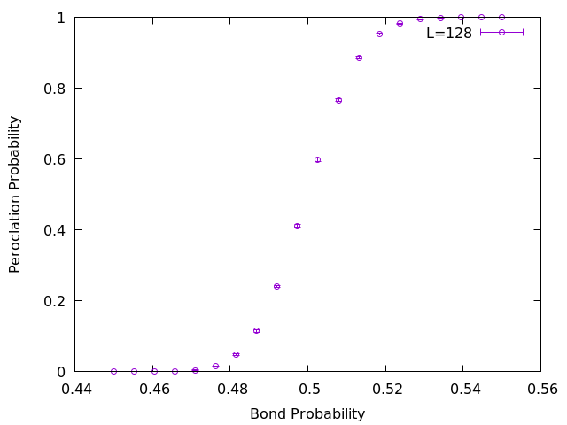

# Python/C++ Parallel Simulation Pipeline

A minimal example of an embarrassingly parallel simulation workflow that uses Python for preparation and analysis, and C++ for the compute-intensive part.

This repository uses bond percolation only as a compact example problem. The main purpose is to demonstrate a reusable Python–C++ workflow for preparing, running, and analyzing many independent jobs.

This repository demonstrates the following pipeline:

1. Read a YAML configuration file with Python.
2. Generate many independent input files.
3. Run a C++ simulation program for each input.
4. Distribute the simulations in parallel with `cps`.
5. Collect the generated data files.
6. Compute averages and standard errors with Python.
7. Plot the summarized result with gnuplot.

## Files

The `cps` and `cpp/param` directories are Git submodules.

- `generate_inputs.py`: generates input files from `input.yaml`
- `analyze_results.py`: reads simulation results and calculates statistics
- `cpp/main.cpp`: C++ entry point
- `cpp/percolation.hpp`: bond-percolation implementation
- `cpp/param`: parameter-file parser
- `cps`: parallel command scheduler
- `output`: generated input and result files
- `plot.plt`: gnuplot script for plotting the summarized result
- `fig/L128.png`: example plot generated from `output/L128.dat`

## Requirements

### C++

A C++ compiler with C++11 or later support is required.

The parallel execution tool `cps` uses MPI, so an MPI implementation such as Open MPI or MPICH is also required.

Typical required commands are:

```console
g++
make
mpic++
mpirun
gnuplot
```

### Python

Python 3.6 or later is required.

The Python dependencies are:

- NumPy
- PyYAML

## Clone the repository

Clone the repository together with its submodules:

```console
git clone --recursive https://github.com/kaityo256/pycpp-parallel-pipeline.git
cd pycpp-parallel-pipeline
```

If the repository has already been cloned without submodules, initialize them with:

```console
git submodule update --init --recursive
```

## Python environment

The Python environment can be created either with `uv` or with the standard-library `venv` module.

### Using uv

Create a virtual environment:

```console
uv venv
```

Activate it on Linux or macOS:

```console
source .venv/bin/activate
```

Install the required packages:

```console
uv pip install numpy pyyaml
```

The scripts can also be executed without manually activating the environment:

```console
uv run python generate_inputs.py input.yaml
```

### Using python3 -m venv

Create a virtual environment:

```console
python3 -m venv .venv
```

Activate it on Linux or macOS:

```console
source .venv/bin/activate
```

Activate it on Windows PowerShell:

```powershell
.venv\Scripts\Activate.ps1
```

Install the required packages:

```console
python3 -m pip install --upgrade pip
python3 -m pip install numpy pyyaml
```

## Build

Both `cps` and the C++ simulation program must be built before execution.

Build `cps`:

```console
cd cps
make
cd ..
```

Build the percolation program:

```console
cd cpp
make
cd ..
```

After a successful build, the following executables should be available:

```text
cps/cps
cpp/percolation
```

## Configuration

The main configuration is specified in `input.yaml`.

A typical configuration has the following form:

```yaml
L: 128
start: 0.45
end: 0.55
num_points: 100
num_samples: 100
num_seeds: 10
output_dir: output
```

The parameters are:

- `L`: linear system size
- `start`: minimum bond-open probability
- `end`: maximum bond-open probability
- `num_points`: number of probability values between `start` and `end`
- `num_samples`: number of samples calculated for each seed
- `num_seeds`: number of independent random seeds
- `output_dir`: directory for generated files

The probability values include both `start` and `end`.

## Generate input files

Generate the input files for the individual C++ jobs:

```console
python3 generate_inputs.py input.yaml
```

When using `uv` without activating the environment:

```console
uv run python generate_inputs.py input.yaml
```

The generated files are stored under the directory specified by `output_dir`.

Example filenames are:

```text
output/L128_p4500_s000.yaml
output/L128_p4500_s001.yaml
output/L128_p4033_s000.yaml
```

In these filenames:

- `L128` represents `L = 128`
- `p4033` represents a bond-open probability of `0.4033`
- `s000` represents random seed `0`

## Run a single simulation

A single simulation can be executed by passing an input file to the C++ program:

```console
cpp/percolation output/L128_p4500_s000.yaml
```

The program writes its result to a corresponding `.dat` file, for example:

```text
output/L128_p4500_s000.dat
```

Each result file contains the estimated percolation probability obtained from `num_samples` realizations.

## Parallel execution

The generated jobs can be executed in parallel with `cps`.

`cps` reads a task file containing one command per line. A typical task file contains commands such as:

```text
cpp/percolation output/L128_p4500_s000.yaml
cpp/percolation output/L128_p4500_s001.yaml
cpp/percolation output/L128_p4510_s000.yaml
```

Run the task file with MPI:

```console
mpirun -np 5 cps/cps cps/task.sh
```

One MPI process is used by `cps` for scheduling. Therefore, with `-np 5`, four worker processes execute simulation jobs.

The exact task-file location and MPI process count can be changed as needed.

## Analyze the results

After all `.dat` files have been generated, analyze them with:

```console
python3 analyze_results.py input.yaml
```

When using `uv` without activating the environment:

```console
uv run python analyze_results.py input.yaml
```

The script groups the results by bond probability, calculates the mean over different seeds, and estimates the standard error of the mean.

The summarized data are written to a file such as:

```text
output/L128.dat
```

The output format is:

```text
# bond_probability percolation_probability std_error
0.4500000000 0.0123000000 0.0012345678
0.4510101010 0.0141000000 0.0013456789
```

The columns are:

1. bond-open probability
2. mean percolation probability
3. standard error over independent seeds

## Plot the result

The summarized result can be plotted with gnuplot:

```console
gnuplot plot.plt
```

The provided `plot.plt` script reads `output/L128.dat` and writes the plot to `fig/L128.png`.



## Typical workflow

The complete workflow using `uv` is:

```console
git submodule update --init --recursive

uv venv
source .venv/bin/activate
uv pip install numpy pyyaml

cd cps
make
cd ..

cd cpp
make
cd ..

python3 generate_inputs.py input.yaml

mpirun -np 5 cps/cps cps/task.sh

python3 analyze_results.py input.yaml

gnuplot plot.plt
```

The same workflow using the standard-library virtual environment starts with:

```console
python3 -m venv .venv
source .venv/bin/activate
python3 -m pip install numpy pyyaml
```

The remaining build and execution commands are unchanged.

## Git submodules

This repository uses the following projects as Git submodules:

- `cps`: parallel command scheduler  
  <https://github.com/kaityo256/cps>
- `param`: C++ parameter-file parser  
  <https://github.com/kaityo256/param>

To initialize the submodules:

```console
git submodule update --init --recursive
```

To fetch newer upstream revisions:

```console
git submodule update --remote
```

Review and test submodule updates before committing the changed references.

## License

This project is distributed under the MIT License.
